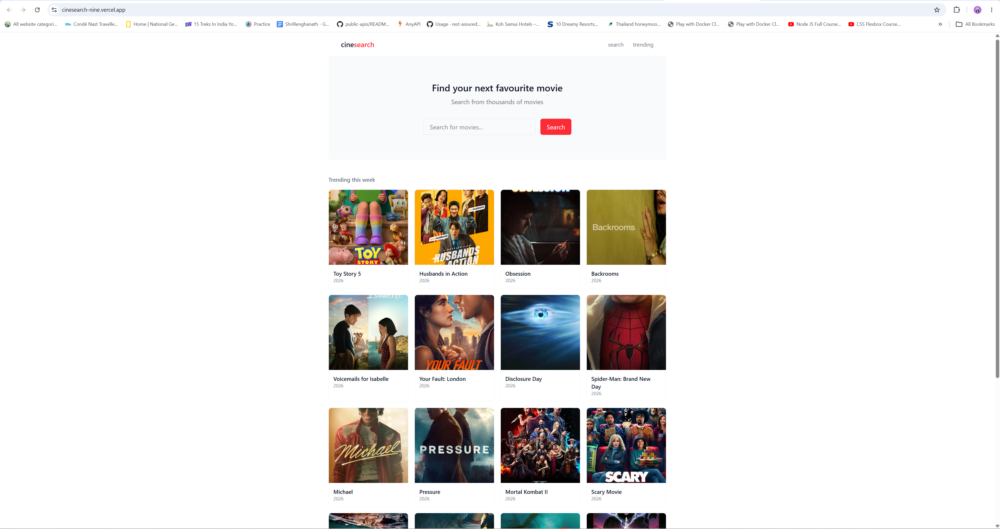

# CineSearch

A movie search app built with Next.js 16 and the TMDB API.

## Features

- Browse trending movies of the week
- Search for any movie by title
- View detailed info — rating, runtime, genres, and overview
- Server-side data fetching with Next.js Server Components

## Tech Stack

- Next.js 16 (App Router)
- TypeScript
- Tailwind CSS v4
- TMDB API

## Getting Started

1. Clone the repo
   git clone https://github.com/rengha93/cinesearch.git

2. Install dependencies
   npm install

3. Create a .env.local file in the root
   TMDB_READ_ACCESS_TOKEN=your_token_here

4. Run the development server
   npm run dev

5. Open http://localhost:3000

## Project Structure

app/
  components/      → Navbar, SearchBar
  movie/[id]/      → Movie detail page
  search/          → Search results page
  page.tsx         → Home page
lib/
  tmdb.ts          → TMDB API functions

## Live Demo

https://cinesearch-nine.vercel.app